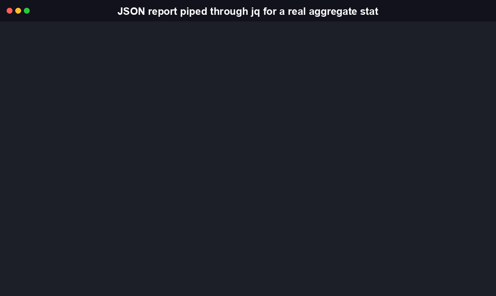
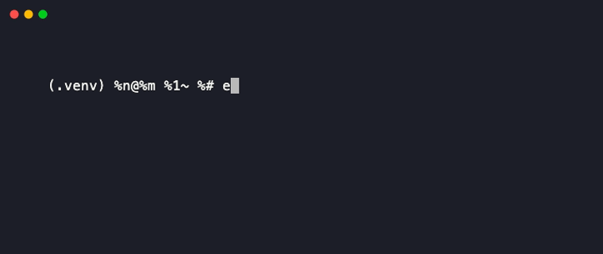

<div align="center">

# MasteryTrace

MasteryTrace is a TypeScript CLI and library that turns a log of learner response events into per-learner, per-skill mastery scores, using Bayesian Knowledge Tracing (BKT) and Item Response Theory (IRT), instead of a raw percent-correct.

[](https://github.com/RudrenduPaul/MasteryTrace/actions/workflows/ci.yml)
[](https://www.npmjs.com/package/masterytrace-cli)
[](https://pypi.org/project/masterytrace-cli/)
[](./LICENSE)


</div>

## Table of Contents

- [Install](#install)
- [Quickstart](#quickstart)
- [CLI command reference](#cli-command-reference)
- [Library API reference](#library-api-reference)
- [How BKT and IRT work](#how-bkt-and-irt-work)
- [Benchmark](#benchmark)
- [Comparison](#comparison)
- [FAQ](#faq)
- [Contributing](#contributing)
- [License](#license)

## Install

MasteryTrace ships as two independent, equally first-class packages that
implement the same two models (BKT, 2PL IRT) and the same CLI contract.

**npm (TypeScript CLI + library)**:

```bash
npm install -g masterytrace-cli
```

Requires Node.js 18 or later.

**pip (Python CLI + library)**: a full, independent Python port of this
repo's TypeScript source lives in `python/` -- same two models, same CLI
contract, its own 75-test pytest suite, built and verified end to end
from a real wheel install.

```bash
pip install masterytrace-cli
```

This installs the same four subcommands (`init`, `record`, `score`,
`report`) as a `masterytrace` console script, plus an importable
`masterytrace` library -- a genuine, independent port of this repo's
TypeScript source, not a wrapper around the Node binary. See
[python/README.md](./python/README.md) for Python-specific usage,
including a documented `camelCase`/`snake_case` naming divergence
between the two distributions' JSON output.

## Quickstart

```bash
masterytrace init
masterytrace record events.json
masterytrace score
masterytrace report
```

`init` scaffolds a sample `events.json` (3 learners, 3 skills, several responses each) and a default `masterytrace.config.json` in the current directory. Real output from that flow:

```
$ masterytrace init
Created: events.json, masterytrace.config.json
Next: run 'masterytrace record events.json' to load it, then 'masterytrace score'.

$ masterytrace record events.json
Stored 58 event(s) to /path/to/.masterytrace/events.json
(record replaces any previously stored event log; see --help for details.)

$ masterytrace score
Scored 58 event(s) with model(s): both
Wrote /path/to/.masterytrace/scores.json

$ masterytrace report
learner        skill                  model  metric                         value    responses
-------------  ---------------------  -----  -----------------------------  -------  ---------
learner-ada    fractions              bkt    posterior_mastery_probability  0.9994   6
learner-ada    fractions              irt    ability_theta                  0.7349   6
learner-ada    linear-equations       bkt    posterior_mastery_probability  0.9746   7
learner-brook  fractions              bkt    posterior_mastery_probability  0.0612   6
learner-cyrus  reading-comprehension  bkt    posterior_mastery_probability  0.9947   7
...
```

`report` also takes `--format markdown` or `--format json`, and every command accepts a global `--json` flag for machine-readable output on stdout, with a real exit code contract (`0` success, `1` general/usage error, `2` bad event data) so a script or agent invoking this CLI can branch on the result without parsing text.

Your own event log is a JSON array of `{ learnerId, skillId, correct, timestamp }` objects, or a CSV with header `learner_id,skill_id,correct,timestamp`. `timestamp` must be ISO 8601; `correct` is a boolean (JSON) or `true`/`false`/`1`/`0` (CSV), and any other value in a CSV `correct` cell is rejected as a validation error rather than silently treated as false. Event log files over 100 MB are rejected up front with a clear error; event logs are small structured records and have no legitimate reason to approach that size.

## CLI command reference

| Command | Arguments | Options | Does |
| --- | --- | --- | --- |
| `masterytrace init` | | `--force` | Scaffolds a sample `events.json` and `masterytrace.config.json` in the current directory. Skips files that already exist unless `--force` is passed. |
| `masterytrace record <path>` | `<path>`: JSON or CSV event log | | Validates an event log and stores it to `.masterytrace/events.json`. Always replaces any previously stored log. |
| `masterytrace score` | | `--model <bkt\|irt\|both>` (default `both`) | Fits and scores the stored event log, writing the result to `.masterytrace/scores.json`. |
| `masterytrace report` | | `--format <table\|json\|markdown>` (default `table`) | Reads `.masterytrace/scores.json` and prints a per-learner, per-skill mastery table. |

Global option: `--json` forces machine-readable JSON on stdout for any command, overriding `--format` on `report`.

Exit codes: `0` success, `1` general or usage error (bad flag, missing file), `2` validation error (the event log itself is malformed).



## Library API reference

Everything below is exported from `masterytrace-cli`'s package entry point (`src/index.ts`, re-exporting `src/core/*` and `src/models/*`):

```ts
import {
  // Event schema and validation
  ResponseEventSchema, parseResponseEvents, EventValidationError,
  type ResponseEvent,

  // Shared model types
  type ScoringModel, type FittedModel, type MasteryReport,
  type MasteryLearnerEntry, type MasterySkillEntry,

  // Engine: runs one or both models
  runScoring, type ModelSelector, type EngineConfig, type EngineResult,

  // BKT
  BktModel, BKT_DEFAULT_PARAMS, runForwardRecursion, fitSkillParamsByGridSearch,
  type BktParams, type BktConfig, type BktFittedModel,

  // IRT
  IrtModel, probabilityCorrect,
  type IrtItemParams, type IrtLearnerResult, type IrtConfig, type IrtFittedModel,

  // Generic JSON/CSV event log adapter
  genericAdapter, parseCsv, type EventAdapter,
} from 'masterytrace-cli';
```

A minimal library usage example:

```ts
import { runScoring, parseResponseEvents } from 'masterytrace-cli';

const events = parseResponseEvents([
  { learnerId: 'l1', skillId: 'fractions', correct: true, timestamp: '2026-01-01T00:00:00Z' },
  { learnerId: 'l1', skillId: 'fractions', correct: false, timestamp: '2026-01-02T00:00:00Z' },
]);

const { reports } = runScoring(events, 'both');
// reports[0].model === 'bkt', reports[1].model === 'irt'
// each learner's report.learners[i].skills[j].value is the mastery estimate
```

`BktModel` and `IrtModel` both implement the same `ScoringModel` interface (`fit(events)` then `score(fittedModel)`), so the engine, and your own code, can treat them interchangeably.

## How BKT and IRT work

MasteryTrace implements two independent psychometric models. They answer different questions and produce different kinds of numbers, so `masterytrace score --model both` runs them side by side rather than picking one.

### Bayesian Knowledge Tracing (BKT)

BKT models one learner's mastery of one skill as a hidden binary state (knows it / does not know it yet) and updates a probability of "knows it" after every response, using four parameters:

- `pInit`: probability the learner already knows the skill before any evidence.
- `pTransit`: probability of learning the skill between one attempt and the next.
- `pSlip`: probability of an incorrect answer despite knowing the skill.
- `pGuess`: probability of a correct answer despite not knowing the skill.

For each response, the forward recursion first updates the belief given the observed outcome (Bayes' rule), then advances it for possible learning before the next attempt:

```
after correct:   P(know | obs) = P(know) * (1 - pSlip) / [P(know) * (1 - pSlip) + (1 - P(know)) * pGuess]
after incorrect: P(know | obs) = P(know) * pSlip       / [P(know) * pSlip       + (1 - P(know)) * (1 - pGuess)]
P(know)_next = P(know | obs) + (1 - P(know | obs)) * pTransit
```

MasteryTrace runs this recursion per learner per skill, in chronological order, and reports the final posterior as that learner's mastery probability for that skill. If you set `"bkt": { "fit": true }` in `masterytrace.config.json`, each skill's four parameters are fit from your own data by a coarse grid search (7 x 7 x 5 x 5 candidate combinations) that minimizes squared error between predicted and observed correctness, instead of using the textbook defaults (`pInit=0.4, pTransit=0.3, pSlip=0.1, pGuess=0.2`).



### Item Response Theory (2PL IRT)

IRT models one continuous learner ability (`theta`) per learner and two parameters per skill treated as an "item": discrimination (`a`, how sharply the item separates high- and low-ability learners) and difficulty (`b`). The probability of a correct response under the 2-parameter logistic model is:

```
P(correct) = sigmoid(a * (theta - b))
```

MasteryTrace fits all of these jointly by gradient ascent on the log-likelihood (joint MLE), with a small L2 penalty pulling `theta`/`b` toward 0 and `a` toward 1. That penalty is what keeps the fit finite for a learner or skill with an all-correct or all-incorrect record, where the unregularized likelihood would otherwise be maximized at infinity. Because the 2PL model is only identified up to a shift and scale of `theta` (shifting `theta` and `b` by the same constant, or scaling `theta`/`b` while dividing `a` accordingly, leaves every predicted probability unchanged), the fit re-centers `theta` to mean 0 and standard deviation 1 after every iteration, the standard way to pin down a single solution.

### A real recovery check

`test/irt.test.ts` fits the model against a synthetic dataset built from known ground-truth `theta`/`a`/`b` values (4,000 responses across 5 learners and 4 skills) and checks that the recovered parameters land close to the true ones once put through the same gauge normalization. Actually run for this README: max absolute error was 0.123 on `theta`, 0.196 on item difficulty, and 0.114 on item discrimination, well inside the test's 0.3 tolerance, in 26 ms of fit time.

## Benchmark

Run locally against synthetic event logs (Node 24, single core, `masterytrace score` invoked as a real subprocess including Node startup):

| Dataset | Events | `--model bkt` | `--model irt` | `--model both` |
| --- | --- | --- | --- | --- |
| Small | 10,000 (50 learners x 20 skills x 10 responses) | 0.06s | 0.10s | 0.11s |
| Large | 100,000 (100 learners x 50 skills x 20 responses) | 0.17s | 0.54s | 0.60s |

BKT with per-skill grid-search fitting (`"bkt": { "fit": true }`, a 1,225-combination grid search per skill) on the 100,000-event dataset took 1.39s. All figures are wall-clock time for the full `masterytrace score` subprocess, including Node process startup, so they reflect what running the command actually feels like rather than an isolated fitting-function microbenchmark.

## Comparison

MasteryTrace's own niche is being a CLI and a TypeScript library at once, with no Python runtime required. Here is how it compares to the established libraries closest to what it does, each checked against its own GitHub repo and package registry page:

| Project | Language | License | Type | Install | GitHub stars |
| --- | --- | --- | --- | --- | --- |
| **MasteryTrace** | TypeScript/Node + Python | MIT | CLI + library | `pip install masterytrace-cli` / `npm install -g masterytrace-cli` | New |
| [pyBKT](https://github.com/CAHLR/pyBKT) | Python (C++ core) | MIT | Library only | `pip install pyBKT` | 268 |
| [girth](https://github.com/eribean/girth) | Python | MIT | Library only | `pip install girth` | 123 |
| [py-irt](https://github.com/nd-ball/py-irt) | Python (PyTorch/Pyro) | MIT | CLI + library | `pip install py-irt` | 170 |
| [DeepTutor](https://github.com/HKUDS/DeepTutor) | Python + TypeScript | Apache-2.0 | Full tutoring application | `pip install -U deeptutor` | 26,000+ |

pyBKT (from UC Berkeley's CAHLR lab) is the most established BKT implementation and supports more BKT variants (forgetting, item-order effects) than MasteryTrace's single textbook-plus-grid-search model. girth and py-irt are both IRT libraries; py-irt is the heavier of the two, built on PyTorch and Pyro for GPU-accelerated fitting of larger IRT models (1PL/2PL/4PL) and ships its own CLI, while girth is a lighter pure-Python option closer in spirit to MasteryTrace's regularized-gradient-ascent 2PL implementation. None of the three is a Node.js package or ships a general-purpose CLI in the same shape as `masterytrace score`/`report`.

DeepTutor is not a competing measurement library. It is a large, actively developed open-source AI tutoring platform (agent orchestration, tutoring workspaces, memory) that, by its own README, does not implement BKT or IRT itself. It is a plausible integration target: DeepTutor could log response events and hand them to MasteryTrace for the actual mastery estimation it does not otherwise do.

## What Is MasteryTrace, and Why Does It Exist

MasteryTrace is an open source TypeScript CLI and library that fits Bayesian Knowledge Tracing and Item Response Theory models to a log of learner response events, then reports calibrated mastery estimates per learner and per skill. It exists because most open source AI tutoring agents are built to hold a conversation and adapt a lesson, not to measure what a learner has actually mastered, while the two psychometric models that do that job rigorously live almost entirely in Python libraries with no equivalent for a Node or TypeScript stack and no CLI a non-Python tool can shell out to. MasteryTrace fills that specific gap: point it at a JSON or CSV event log, get a mastery probability (BKT) and an ability estimate (IRT) back, in a format any script, tutoring product, or agent can parse.

## FAQ

**Why not just use pyBKT or py-irt?** If you want more BKT variants (forgetting, item-order effects) or GPU-scale IRT fitting, those are good choices, and MasteryTrace's comparison table above says so directly. MasteryTrace's Python package (`pip install masterytrace-cli`) covers the same simple textbook-BKT-plus-grid-search and regularized-2PL-IRT models this repo implements, for a Python-only pipeline; the TypeScript package (`npm install -g masterytrace-cli`) additionally covers the case where you want mastery scoring in a Node codebase with no Python runtime at all.

**Does this need a database?** No. State is two JSON files in a `.masterytrace/` directory next to where you run the CLI (`events.json` and `scores.json`). There's no server and no external dependency to run.

**Can I plug in my own tutoring app's data?** Yes, as long as you can produce a JSON array or CSV of `{ learnerId, skillId, correct, timestamp }` rows. There's no per-app adapter yet; the bundled `genericAdapter` covers both formats. If your data has a different shape, transform it to that shape (or call `parseResponseEvents` on already-shaped rows) before calling `runScoring`.

**Is the BKT/IRT math trustworthy?** Both models are unit-tested against hand-computed worked examples (BKT) and a synthetic dataset with known ground-truth parameters (IRT), in addition to the full CLI test suite. See [How BKT and IRT work](#how-bkt-and-irt-work) above for the real recovery numbers.

**What happens with a single response, or no responses at all?** Both models handle it without erring: BKT with one response returns a single posterior; an empty event log returns an empty report for either model rather than throwing.

**What is MasteryTrace, in one sentence?** It is a CLI and library, shipped as both a TypeScript/Node package and an independent Python port, that turns a JSON or CSV log of learner response events into per-learner, per-skill mastery scores using two named psychometric models (BKT, 2PL IRT) rather than a raw percent-correct; it does not hold a conversation or run a lesson itself.

**What platforms and language runtimes does it support?** The TypeScript CLI/library requires Node.js 18 or later (see `engines.node` in `package.json`) and has no OS-specific code path. The Python port requires Python 3.9 through 3.13 (see the classifiers in `python/pyproject.toml`) and is also declared OS-independent. Neither distribution needs a database or any other runtime dependency.

**How does MasteryTrace compare to pyBKT specifically?** pyBKT (CAHLR/UC Berkeley, 268 GitHub stars at last check) is the more mature BKT implementation: it has a compiled C++ fitting core and supports BKT variants MasteryTrace does not, such as forgetting and item-order effects. MasteryTrace's BKT is the single textbook four-parameter model plus an optional grid-search fit, deliberately simpler. The difference that matters for choosing between them: pyBKT is Python-only, MasteryTrace ships as a Node/TypeScript package too and exposes both models behind one CLI (`masterytrace score --model bkt|irt|both`) instead of a BKT-only library.

**Is there an npm package?** Yes, `npm install -g masterytrace-cli` is live on the npm registry. It ships the same four subcommands (`init`, `record`, `score`, `report`) as the Python port, built from the same TypeScript source that passes CI.

**Can I use MasteryTrace in a commercial product?** Yes. Both the TypeScript and Python code are MIT licensed (see [LICENSE](./LICENSE) and the matching classifier in `python/pyproject.toml`), which permits commercial use, modification, and redistribution with attribution and comes with no warranty.

## Contributing

Issues and pull requests are welcome, for either the TypeScript codebase
(repo root) or the Python codebase (`python/`). See
[CONTRIBUTING.md](./CONTRIBUTING.md) for the full guide. TypeScript
quickstart:

```bash
npm install
npm run lint
npm run typecheck
npm run test:coverage
```

The project keeps 100% statement/line/function coverage and a clean `eslint`/`tsc`/`npm audit`; a change that drops any of those is unlikely to be merged as is. Python quickstart in [python/README.md](./python/README.md#contributing).

## License

MIT, see [LICENSE](./LICENSE).
